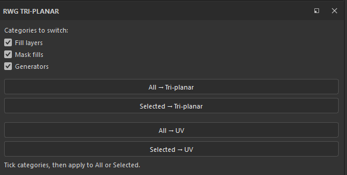

# RwG Tri-planar — Wiki

A small **Substance 3D Painter** plugin that switches the **projection** of many
layers at once — fill layers, texture-driven masks, and generators — instead of
opening each one and changing it by hand.



> Each `##` section is self-contained and can become its own wiki page; the Table
> of Contents maps to them.

---

## Table of contents

1. [What it does](#what-it-does)
2. [Why it exists](#why-it-exists)
3. [Requirements](#requirements)
4. [Installation](#installation)
5. [The panel](#the-panel)
6. [Categories](#categories)
7. [Step by step](#step-by-step)
8. [How it works](#how-it-works)
9. [Troubleshooting & FAQ](#troubleshooting--faq)
10. [Known limitations](#known-limitations)
11. [Changelog](#changelog)
12. [Credits & license](#credits--license)

---

## What it does

Adds a dock with buttons to switch projection to **Tri-planar** (or back to
**UV**) for either the **whole stack** or only the **selected** layers, with
checkboxes to target three categories independently:

- **Fill layers** — content fill layers.
- **Mask fills** — texture-driven masks (fill effects inside a mask stack).
- **Generators** — generators that carry their own Tri-planar switch
  (`Use_Triplanar` and similar).

The status line reports what changed, e.g. *"Triplanar: 8 fill layer(s), 3 mask
fill(s), 2 generator(s) updated"*.

---

## Why it exists

Smart materials usually set each texture's projection to **UV**. On a model with
stretched or non-unwrapped UVs you often want **Tri-planar** instead — but
Painter has no built-in "switch them all", and multi-selecting layers does **not**
propagate a projection change (the Properties panel edits only the active layer).
So changing a whole smart material means clicking through every fill, every mask
and every generator. This plugin does it in one click.

---

## Requirements

- **Substance 3D Painter 10.0 or newer.** The layer-stack scripting API (with
  `set_projection_mode` on fill layers) was introduced in 10.0. On older versions
  the plugin can't switch projection.

---

## Installation

1. Copy **`rwg_triplanar.py`** into Painter's Python plugins folder:

   ```
   Windows:  C:\Users\<you>\Documents\Adobe\Adobe Substance 3D Painter\python\plugins\
   ```

2. Restart Painter, or **Python → Reload Plugins**.
3. The dock **RwG Tri-planar** appears (also under the *Window* menu).

---

## The panel

Top: three **category checkboxes** (Fill layers / Mask fills / Generators), all
on by default. Below: **All → Tri-planar**, **Selected → Tri-planar**, then
**All → UV**, **Selected → UV**. A status line at the bottom reports the result.

- **All** — walks the whole stack (recursing into groups).
- **Selected** — only the selected layers / groups (and everything inside a
  selected group).

Both respect the ticked categories.

---

## Categories

The plugin sorts everything it finds into three buckets so you can target them
separately:

| Category | What it is | How it's switched |
|---|---|---|
| **Fill layers** | Content fill layers (and content fill effects). | `set_projection_mode(Tri-planar)` |
| **Mask fills** | A texture used as a mask — a fill effect inside a layer's mask stack. | `set_projection_mode(Tri-planar)` |
| **Generators** | A generator effect with its own Tri-planar option. | its `Use_Triplanar`-style parameter is toggled |

Tip: untick the ones you don't want. E.g. tick only **Mask fills** and hit
**All → Tri-planar** to convert just the texture masks and leave everything else
alone.

---

## Step by step

Switch a whole smart material to Tri-planar:

1. Select the smart material's **group** in the layer stack (or nothing, and use
   **All**).
2. In **RwG Tri-planar**, leave all three categories ticked.
3. Click **Selected → Tri-planar** (just that group) or **All → Tri-planar**
   (everything).
4. Read the status line — it counts fills, mask fills and generators changed.

To revert, use the matching **→ UV** button.

---

## How it works

- **Fill layers & mask fills** — both are `FillLayerNode`s with a
  `set_projection_mode(...)` method; the plugin calls it with
  `ProjectionMode.Triplanar` (or `ProjectionMode.UV`). They are told apart by
  `is_in_mask_stack()` only so the status can count them separately.
- **Generators** — a `GeneratorEffectNode` has no projection mode; its Tri-planar
  option is a parameter on its `SourceSubstance`. The plugin reads
  `get_parameters()`, finds a **boolean enable switch** whose name contains
  `triplanar` and reads like an enable (`use` / `enable` / `activate`, or just
  `triplanar` / `use_triplanar`), sets it to 1 (or 0 for UV), and writes it back
  with `set_parameters()`. Float parameters such as `Triplanar_Blending_Contrast`
  or a `…Scale` are deliberately left untouched.
- **Traversal** — starts from `get_root_layer_nodes()` (All) or
  `get_selected_nodes()` (Selected), recurses into group children, and also into
  each node's **content and mask effects**, so masks and generators nested
  anywhere are reached. A `uid` set prevents processing the same node twice.

---

## Troubleshooting & FAQ

**The dock/buttons do nothing / an error in the Log.** — You need **Painter
10.0+**. Older versions lack the projection API.

**A texture mask didn't switch with "All".** — Fixed since the first build: masks
(fill effects in a mask stack) are now walked too. Make sure the **Mask fills**
category is ticked.

**A generator didn't switch.** — Only generators with a **boolean** Tri-planar
switch (like `Use_Triplanar`) are toggled. Generators that use a projection
**enum** (0 = UV / 1 = Tri-planar) are skipped on purpose (see limitations).

**"Nothing selected"** — the **Selected** buttons need a layer/group selected;
use the **All** buttons otherwise.

**Nothing happened, no error.** — Check the ticked categories, and that the stack
actually has fills/masks/generators of those kinds; the status line says how many
matched.

---

## Known limitations

- Generators that expose Tri-planar as a **projection enum** (`0 = UV`,
  `1 = Tri-planar`) rather than a boolean switch are **not** auto-toggled — the
  meaning of the number varies per generator, so it's skipped to avoid setting a
  wrong value. Report the generator's parameter names to have it added.
- Fill **effects** inside a content stack are counted as "fill layers".
- Paint layers and non-fill effects (filters, levels, …) have no projection and
  are skipped.

---

## Changelog

### v0.1.0 — Preview (2026-08-15)

First release: dock with **All / Selected → Tri-planar** and **→ UV**; category
checkboxes (**Fill layers**, **Mask fills**, **Generators**); recurses groups and
content/mask effects; toggles a generator's `Use_Triplanar`-style switch;
per-category counts in the status line. Requires Painter 10.0+.

---

## Credits & license

Built by **RwG**. Licensed under the **RwG Tri-planar License (Non-Commercial)** —
free to use, share and adapt with credit; not for sale; all IP stays with RwG.
See `LICENSE`.
